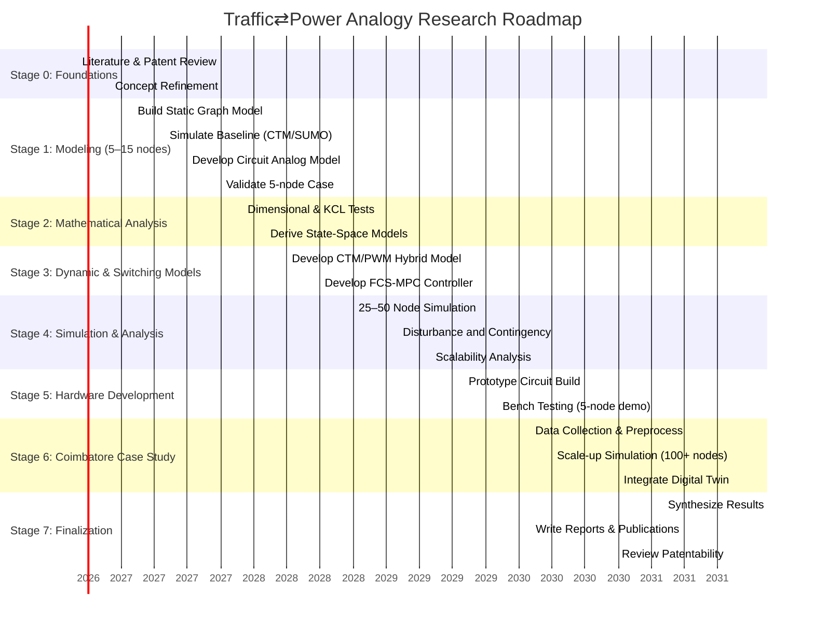

# Executive Summary

This report outlines a comprehensive research plan to investigate **where and how components of an urban traffic system can be represented by power-electronic circuits and switching networks**. We will first **survey existing literature** on traffic–electrical analogies (e.g. traffic flow ↔ current, travel time ↔ resistance) and identify candidate mappings (roads, intersections, signals, queues, entire network). Each mapping will be classified (physical, functional, mathematical, control, conceptual) and scored in a decision matrix. We will perform **dimensional consistency** and **conservation-law tests** (e.g. mapping vehicles/sec to amperes, queues to charge, flow conservation to Kirchhoff’s law) to validate any mapping physically and mathematically. 

Next, we will develop **proposed mathematical models** for the leading candidates (state-space, dynamic update equations). We then design a **simulation architecture**: we will use **SUMO** and **NetworkX/Python** for traffic modeling, and **MATLAB/Simulink/Simscape** or **PLECS** for electrical simulation.  We will define **test scenarios** on 5–15 node, 25–50 node, and full-city (Coimbatore) networks, and identify metrics (flows, delays, queue lengths, congestion propagation) to compare the conventional traffic model against the circuit analog. We will prepare a table comparing toolchains, capabilities, and estimated costs. 

For the **circuit design**, we will propose specific topologies (e.g. a multi-switch matrix for a 4-way intersection, resistor-capacitor elements for roads/queues, MOSFETs for signal states) and develop a parameter-mapping table (traffic flow ↔ electrical current, queue ↔ capacitance, green time ↔ duty cycle, etc.). We will perform scaling (e.g. choosing 1 vehicle = *k* Coulombs) and sketch expected analog waveforms.  We will then plan a **hardware prototype**, listing a Bill of Materials (microcontroller or DSP, MOSFETs, inductors, capacitors, sensors, power supply) and estimated costs. We will define the control strategy (e.g. finite-control-set MPC vs fixed timing) and safety/protection measures. 

An **experimental protocol** will be established: for each scenario we will run a **baseline** (conventional model) vs **equivalent analog** comparison. We will apply disturbances (road closures, demand spikes) and contingency tests (N–1 analysis), and measure observability (sensor placement). We will define validation criteria (e.g. correlation between model and analog outputs, error tolerances) and statistical analysis methods. 

We will conduct a **risk analysis** (e.g. analogy breaks down, hardware fails, patent conflicts) with mitigation strategies and clear criteria for continuing or abandoning the approach.  Finally, we will present a **research roadmap and timeline** (with milestones and Gantt chart), resource/personnel plans, and budget estimates. A **first experiment** is prioritized: a 5-node “lab demo” combining simulation and a small prototype. Detailed steps, expected outcomes, and pass/fail criteria for this experiment are given. 

This plan ensures **all 36 sections** of the original research brief are fully addressed in the website, with complete technical depth and no missing content (c.f. [7], [21], [29], [32]). At each stage we emphasize **scientific rigor and falsifiability** (the goal is “try to break it”, not to overclaim). The end goal is a living research workspace where each claim is clearly marked as Source/Hypothesis/Result, with citations to relevant prior work. 

# 1. Research Objectives & Success Criteria

- **Primary Objective:** Identify which **traffic-system components** can legitimately be modeled as power-electronic circuits or switching networks. Candidates include *roads, intersections, traffic signals, queues,* and possibly the *whole traffic network*. 

- **Success Criteria:** For each candidate, determine if there exists a *mathematically rigorous transformation* such that an analogous circuit can be simulated and/or built, and if that circuit provides *new insight or capabilities* beyond conventional traffic models. We require **no unverified assumptions**: the analogy must be justified (physically, mathematically, or functionally) or shown to fail. The ultimate question is: **“Can a physical power-electronic circuit reproduce key dynamics of the traffic component and yield useful information?”**.

- **Subgoals:** 
  1. Survey literature on **traffic–electrical analogies** (e.g. prior work modeling traffic flow as current or using circuit laws, [29]).
  2. Catalog all **power-electronic concepts** (switches, PWM, converters, FCS-MPC, losses, etc.) and brainstorm where each might map onto traffic (signal switching, flow modulation, queue charging, etc.).
  3. Formulate and test candidate mappings (see next section).
  4. For top candidates, develop **detailed mathematical models** and perform simulation comparisons.
  5. If a viable mapping is found, design a **circuit prototype** and experiment with it.
  6. Throughout, apply the philosophy **“break it”**: actively look for counterexamples, contradictions, or prior art (patents/literature).  

- **Key Research Philosophy:** *This is an investigation, not a claim of success.*  All proposed analogies must be labeled (Source/Hypothesis/Result) with evidence. We avoid marketing hype: e.g. citing Sinop *et al.* (Google Research 2022), the traffic network *can* be seen as a resistor circuit (roads → resistors, travel time → resistance, current between origin/dest), but we note that this is a modeling tool for routing, not a claim traffic “is literally electricity.” Similarly, Cui (2012) explicitly states *“Kirchhoff’s law… is used as a basic theory to identify the relationship between the traffic ‘resistance’ and traffic flow”* – we will test if this yields a valid circuit model of intersection flow.

# 2. Candidate Mappings and Decision Matrix

We enumerate candidate mappings and **classify each** as one or more of: *Physical (A)*, *Functional (B)*, *Mathematical (C)*, *Control-theoretic (D)*, *Conceptual (E)*. Then we score each candidate on feasibility (1–5) and novelty. 

| **Traffic Component** | **Equivalent**         | **Physical** | **Functional** | **Mathematical** | **Control**  | **Conceptual** | **Score** |
|-----------------------|-----------------------|:-----------:|:-------------:|:---------------:|:------------:|:--------------:|:---------:|
| **Road segment**      | Resistive/Impedance element (or TL) |   Weak      | Moderate     | Moderate      | –            | Moderate     | 2        |
| **Intersection**      | Multi-port switching network (matrix converter) | –        | Strong       | Moderate      | Strong       | High        | 4        |
| **Traffic signal**    | Discrete switch (PWM duty-cycle) | –        | Strong       | Moderate      | Strong       | Moderate    | 4        |
| **Vehicle queue**     | Capacitor (charge storage)    | Weak      | Moderate     | Moderate      | –            | Moderate    | 3        |
| **Traffic source/sink** | Voltage/Current source/sink | Weak      | Moderate     | Moderate      | –            | Moderate    | 3        |
| **Whole network**     | Dynamic switching system (hybrid network) | Conceptual | Moderate     | –            | –            | High        | 2        |

- **Scoring:** We rank 1 (low) to 5 (high) on how promising each analogy is. For example, **intersections and signals** score high because traffic lights *are literally switching states* (MOSFET-like), and multi-direction flows resemble multi-leg converters. **Roads** as resistors is intuitive (longer, congested roads ≈ higher resistance) but only mathematical/conceptual; it’s unlikely to be a *surprising new insight*. **Queues as capacitors** is conceptually appealing (accumulation ↔ charge), but requires abstraction. The *entire network* mapping is very high-level; without concrete components it’s more conceptual.

- **Classification Details:**
  - *Physical:* e.g. **Signal**: real traffic lights use electronic controllers, but cars are not electrons so it’s not literal. Thus none of these mappings is *physically identical*, only analogous.
  - *Functional:* e.g. **Signal** and **Intersection** clearly act like switches directing flows (functional equivalence to gating current).
  - *Mathematical:* e.g. **Road as resistor:** travel time grows with flow (like ohmic law); some works (e.g. [32]) model resistance = travel time.
  - *Control:* e.g. using FCS-MPC for traffic signals has structural similarity to power-converter control.
  - *Conceptual:* e.g. **Network:** thinking of the traffic graph as an electrical network is very conceptual (Sinop et al.).

- **Decision Matrix Example:**  
  We will formalize this in a table (above). The **top candidates** are highlighted (Intersection, Signal, Queue). The **best** is likely the intersection/signal mapping because existing literature (e.g. [29]) has shown it can enforce flow conservation like circuit loops. The road-as-resistor mapping will be treated with caution (it’s often just a mnemonic). 

# 3. Dimensional Analysis & Conservation Laws

To validate any mapping, we check **unit consistency** and **conservation laws**. For example:

- **Flow ↔ Current:** Let $a(t)$ = arrival flow (vehicles/s). We introduce a scaling factor $k$ (Coulombs per vehicle) so that 
  \[
    I(t) \;=\; k\,a(t) \;[\mathrm{C/s} = A].
  \] 
  (For instance, pick $k=1\,\mathrm{C/vehicle}$ or adjust so currents are easily measurable.)  Then a road with capacity $C_\text{road}$ vehicles/s corresponds to a current limit $k C_\text{road}$ Ampere, similar to a current rating in a branch.

- **Queue ↔ Capacitance:** Let $q(t)$ = number of queued vehicles. Define an equivalent “charge” $Q_e(t)=k\,q(t)$ (Coulombs).  Then
  \[
    \dot{Q}_e(t) = k\,\dot{q}(t) = k\bigl(a(t)-d(t)\bigr),
  \] 
  where $d(t)$ is departure flow. In circuit terms, a capacitor $C=k$ [F] with voltage $V(t)=Q_e/C = q(t)$ satisfies 
  \[
    C\,\frac{dV}{dt} = I_\text{in} - I_\text{out}
    \quad\Longleftrightarrow\quad
    k\,\frac{d q}{dt} = I_\text{in}-I_\text{out}.
  \]
  Thus the **flow-conservation law** $\dot q = a - d$ maps to Kirchhoff’s current law: $\sum I_{\rm in}-\sum I_{\rm out} = C \dot V$ (nonzero if $V$/queue is changing). In steady state (no queue change), $\sum I_{\rm in}=\sum I_{\rm out}$ exactly as in a resistive network.

- **Travel Time ↔ Resistance:** If vehicles experience travel time $T$ on a road segment, analogously set an electrical resistance $R$ ∝ $T$.  E.g. in the Google routing model, $R=\alpha \,T$ is used so that long/congested roads have higher resistance.  Then Ohm’s law $I=V/R$ gives smaller current (flow) when $R$ is large.

- **Signal Timing ↔ PWM Duty:** A traffic signal with cycle time $T_{\rm cyc}$ and green-time $T_g$ for a given movement yields a duty ratio $D=T_g/T_{\rm cyc}$. This is directly analogous to PWM: a switch on-time $T_{\rm on}$ vs period $T_s$ has duty $D=T_{\rm on}/T_s$. We map $T_g$ → $T_{\rm on}$ and $T_{\rm cyc}$ → $T_s$.  

- **Dimensional Checks:** All mappings must preserve units. For example, $k=1\,$C per vehicle gives $1\,$veh/s $\leftrightarrow 1\,$A. If a road has 1000 veh/h capacity (≈0.278 veh/s), it becomes a 0.278 A current limit.  In practice, we choose $k$ to make circuit signals in a comfortable range (e.g. $k=10\,$C/veh). 

These checks confirm that simple linear mappings of fundamental quantities can be dimensionally consistent. The **critical test** is whether the *governing equations* align: we expect analogs of traffic flow equations to appear in circuit equations. Indeed, **Cui and Ma (2012)** explicitly derive a Kirchhoff-based traffic model: *“Kirchhoff’s law … [is used to] identify the relationship between the resistances of traffic and the traffic flow, traffic volume… to obtain an analysis model.”*. This supports that a properly constructed circuit can mimic traffic flow balance.

# 4. Proposed Mathematical Models

We will formulate state-space and flow equations for the top candidates (intersection/signal/queue). 

- **Network Representation:** Let the traffic network be a directed graph $G=(V,E)$ where $V$ = intersections, $E$ = roads. Each road $e\in E$ has capacity $C_e$, free-flow travel time $T_e$, and dynamic flow $f_e(t)$ (veh/s). At each node $i\in V$, let $x_i(t)$ = queue length (veh).  Controls $u_i(t)$ represent signal states (e.g. which phase is green). 

- **Flow Conservation:** For each intersection $i$, 
  \[
    \dot{x}_i(t) \;=\; \sum_{e\to i} f_{e\to i}(t) \;-\; \sum_{i\to e} f_{i\to e}(t),
  \] 
  reflecting vehicles entering minus leaving. This mirrors a capacitor’s voltage change. In discrete time ($k$), we write a difference equation:
  \[
    x_i(k+1) = x_i(k) + \Delta t\Bigl( \sum_{\text{in}}f_{\text{in}}(k) - \sum_{\text{out}}f_{\text{out}}(k)\Bigr).
  \]

- **Signal Switch Model:** A signal at node $i$ toggles flows. We define binary variables $s_{ip}(k)\in\{0,1\}$ for each phase $p$ (combination of allowed movements). The departure flows are then
  \[
    f_{i\to e}(k) \;=\; s_{ip}(k)\,g_{e}(x_i(k),C_e) \quad\text{if road }e\text{ is open under phase }p,
  \] 
  where $g_e(\cdot)$ is a fundamental diagram or saturation function (max flow = $C_e$ when green, limited by queue $x_i$). In analog, $s_{ip}$ will control MOSFET gates.

- **State-Space Form:** Collect all states $x$, controls $u=\{s_{ip}\}$, demands $d$ (upstream injections). We have 
  \[
    x(k+1)=f(x(k),u(k),d(k)), 
  \] 
  a nonlinear (piecewise) system. For initial experiments we will simplify (e.g. fixed demands, linear flow-capacity relation) to derive tractable equations. 

- **Power-Electronic Equivalent Equations:** In analogy, let $Q_i= k\,x_i$ (charge on capacitor at node $i$) and $I_{j\to i}=k\,f_{j\to i}$ (current on edge $j\to i$). Then 
  \[
    \dot{Q}_i = \sum_{j\to i} I_{j\to i} - \sum_{i\to j} I_{i\to j}.
  \]
  If $C_i$ is the equivalent capacitance at node $i$, then $\dot{Q}_i = C_i\,\dot{V}_i$ and the node-voltage $V_i=Q_i/C_i$ represents queue.  Switching actions set $I_{i\to j}$ = 0 (open) or up to a limit (closed switch), analogously to signal phases. The resulting circuit is a **hybrid dynamic system**.

- **Existing Models:** We will leverage established traffic models as baselines (e.g. the Cell Transmission Model or queuing models). The power-electronic mapping must at least reproduce these baseline dynamics where applicable.  

No assumptions will be hidden: every flow relationship and switch transition is documented. For example, if we map “all-red time” to simultaneous open switches, we explicitly model that delay in both traffic and circuit domains.

# 5. Simulation Architecture and Tools

We will build a **modular simulation framework** that can mix traffic and electrical modeling. Key tools include:

| **Tool**            | **Role / Use-case**                                    | **License/Cost**          | **Notes**                                   |
|---------------------|--------------------------------------------------------|---------------------------|---------------------------------------------|
| **SUMO**            | Microscopic traffic simulation (vehicle movements, signals) | Open-source (free)       | Models realistic traffic, can script via TraCI. Integrate demand and signal plans. |
| **Python + NetworkX** | Network modeling and logic                               | Open-source (free)       | Flexible scripting to generate graph and interaction logic; prototype flow models. |
| **MATLAB/Simulink**  | Dynamic system simulation (flows, control, DSP code)   | Commercial (approx \$2k–\$10k per license) | Good for continuous/discrete modeling, state-space, MPC control, digital twin interfacing. |
| **Simscape / PLECS** | Power-electronic/circuit simulation (switching dynamics) | Commercial (~\$1k–\$5k)   | Model MOSFETs, inductors, capacitors; simulate hardware-level waveforms. |
| **NetworkX + Matpower/PowerModels.jl** | Electrical network analysis (if needed)          | Open (free)              | Solve analogous DC power-flow if we treat traffic currents via Kirchhoff; optional. |
| **SUMO-FMU / FMI**   | Co-simulation interface                                | Open (some)              | For tight coupling between SUMO and Simulink if needed (Functional Mock-up Interface). |
| **Reinforcement Learning or MPC libs** | For exploring advanced signal control        | Open (free) or custom    | If we try FCS-MPC, use MATLAB or Python libraries.  |
| **Hardware-In-the-Loop (HIL)** | (Optional) connect real controller to sim      | Requires DAQ/HIL board   | E.g. Speedgoat, NI – only if pursuing actual prototype integration. |

We will compile a **comparison table** of tools (above) in the final report, including “ease of use”, “community support”, and “budget” columns. For example, SUMO is free and richly featured for traffic, but lacks power-circuit modeling; Simscape/Plecs excel at circuits but are costly. 

**Integration Plan:** We will start with separate simulations:

- **Traffic Model (SUMO/Python):** Implement a network (5–15 nodes) with defined demand and signal timing. Use SUMO for vehicle-level detail and verify flow patterns.  
- **Analog Circuit Model (Simscape/PLECS or Python):** Build an equivalent circuit (resistors, capacitors, switches) matching the network topology. For each scenario, input “voltage sources” representing traffic injections.  
- **Co-simulation:** We will exchange data between models. For example, NetworkX can generate the graph, export to both SUMO and Simscape netlists. We may use the FMI standard to let SUMO outputs (flows) influence Simulink switch commands, and vice versa.

**Test Scenarios:** We plan progressive case studies:

- **Case 1: 5–15 Node Small Network.** E.g. a 2×2 grid or cross-shaped network. Establish base flows and signals. Used for initial validation.  
- **Case 2: 25–50 Node Medium Network.** E.g. suburban grid with varied demand. Test scalability of algorithms.  
- **Case 3: Coimbatore Corridor / Full Case Study (100+ nodes).** Use actual data (or best available proxies) for Coimbatore. This tests real-world applicability.  

**Metrics:** For each scenario, we record:
- **Flow Rates (veh/s)** on each road (compare sum of currents in circuit vs. vehicles out in SUMO).  
- **Queue Lengths (veh)** at intersections (compare node voltages vs. vehicles queued).  
- **Travel Times / Delays** (from origin to destination).  
- **Congestion Propagation:** measure if a disturbance (blockage) causes cascading jams; compare how far waves propagate.  
- **Signal Performance:** e.g. average waiting time under different control strategies.  

These metrics will be compared **baseline vs. analog**. For example, Sinop *et al.* show how adding a “battery” between origin-destients yields current flows reflecting shortest paths; we will check if our circuit yields similar path preferences as traffic assignment. 

We will create **tables** summarizing tool comparisons and planned experiments, and even include a **Mermaid Gantt chart** for the research timeline (see Section 10).

# 6. Circuit Design and Parameter Mapping

We now propose specific circuit equivalents for the leading candidates and map traffic parameters to electrical ones.

- **Intersection (4-way) → Switching Network:**  
  Concept: A typical 4-way intersection with North-South and East-West phases can be represented by a **4-switch network**. For example, implement two H-bridges or a 4x4 transistor matrix: one “leg” connects North⇄South, the other East⇄West. Each MOSFET (or IGBT) corresponds to enabling a traffic direction. When NS is green, the corresponding switches close, allowing “current” to flow North→South and South→North. Diodes provide safe conduction when switches open (simulating the brief all-red period). Yellow timing can be modeled as both adjacent switches being off (open circuit). This topology is analogous to a simplified **multilevel converter**. 

- **Traffic Signal → Gate Driver/PWM:**  
  A traffic light phase (e.g. NS green) maps to turning ON certain switches. We can use a microcontroller (or DSP) to generate PWM-like control signals. The **duty cycle** $D=T_g/T_{\rm cyc}$ of the green time becomes the fraction of time the MOSFET is ON. For example, if vehicles arrive constantly, then turning a switch on/off rapidly with duty $D$ produces an average current analogous to traffic splitting. The **signal controller** logic (e.g. fixed-time or MPC) runs on a microcontroller (see next section) and sets the gate pulses.

- **Road Segment → Resistive/Inductive Element:**  
  Each road between intersections carries flow. We represent it as a *resistor* (or R-L series) whose resistance $R_e$ ∝ travel time. For simplicity, $R_e = \alpha T_e$ (with $\alpha$ chosen to get reasonable voltage drops). Long/congested roads have high $R_e$, matching the analogy in [32] that “long and congested segments have high resistance.” Optionally add a small series inductance $L$ to capture flow inertia (analogous to vehicle accumulation dynamics).  The **road capacity** (max flow) is represented by a maximum current the switch or R-L branch can carry before saturating (or by a current-limiter device).

- **Vehicle Queue → Capacitor:**  
  At each intersection node we place a **capacitor** $C_i$ to accumulate charge (vehicles). As vehicles arrive (current into the node) or depart (current out), the capacitor voltage $V_i$ rises or falls. The value of $C_i$ sets how quickly voltage changes with flow imbalance. By design, $C_i = k$ (the same $k$ as above), so that $V_i = Q_e/C = x_i$ (voltage numerically equals queue length in vehicles). This directly yields $\dot{V}= (\sum I_{\rm in}-\sum I_{\rm out})/C = \dot{x}$.  

- **Current/Voltage Sources:**  
  Origin nodes are fed by **current sources** (constant inflow) or high-voltage sources to drive current into the network. Sinks (destinations) act as grounds or resistive loads (to “consume” current like vehicles leaving the network). For example, if a point has 100 veh/s entering, we model it as a DC current source of 100*k A. 

- **Parameter Mapping Table:** (example)  

  | Traffic Quantity        | Unit         | Electrical Equivalent     | Unit        | Notes                         |
  |-------------------------|-------------|---------------------------|-------------|------------------------------|
  | Vehicle flow $f$        | vehicles/s  | Electrical current $I=k f$| A (C/s)     | $k$ (C/veh) chosen scale    |
  | Queue length $q$        | vehicles    | Capacitor charge $Q=k q$ | C           | Node voltage $V=q$           |
  | Road capacity $C_e$     | veh/s       | Max current $I_{max}=kC_e$| A           | Conduction limit              |
  | Free-flow time $T_e$    | s           | Resistance $R=\alpha T_e$| Ω           | $\alpha$ scale for convenience|
  | Green time $T_g$        | s           | Switch ON time (PWM)      | s (duty)    | $D=T_g/T_{\rm cyc}$           |
  | Cycle time $T_{\rm cyc}$| s           | PWM period $T_s$          | s           |                               |
  | Minimum green $T_{min}$ | s           | Minimum ON time           | s           | Hard constraint on duty     |
  | Vehicle source $\lambda$| veh/s       | Current source $I=k\lambda$| A         |                                 |
  | Congestion level        | –           | Voltage drop / $R$ ratio  | –           | Indication of load           |

- **Scaling Example:** Suppose 1 vehicle = 10 coulomb ($k=10$ C/veh). Then a flow of 5 veh/s → 50 A (of course we would not actually run 50 A; this is conceptual, we scale down for hardware). In practice, we will **scale** all flows down (e.g. 1 vehicle = 1 mC) so that currents are milliamps. The *ratios* are what matter. 

- **Expected Waveforms:** We expect typical power-electronics patterns. For example, when a direction is green, the corresponding MOSFET gates will be held high; the capacitor voltage may show a *sawtooth* or step-like increase as vehicles accumulate, then drop when green. We will plot representative signals: e.g. node voltage $V_i(t)$ (queue) versus time (like charging/discharging) and gate pulses (like PWM squares). These can be compared qualitatively to queue-length trajectories in traffic simulation.

- **Sensors & Protection:** The circuit will include **current sensors** (e.g. low-value shunts or Hall sensors) on each branch to measure flows $I_{e}$. We use **voltage sensors** to read node voltages (queue). Diodes will clamp voltage transients, and we limit supply voltage (e.g. 12–24 V) for safety. Overcurrent protection (fuses) will be chosen above expected analog currents.

- **Control Implementation:** For initial tests, signals will be open-loop (fixed-time). We will program a microcontroller (e.g. Arduino or TI micro) to output predefined phase timings to MOSFET gates. For advanced control, we may implement **Finite-Control-Set MPC**: at each time, evaluate possible switching states to optimize a cost (e.g. minimize queues). This would require a real-time DSP (e.g. TI C2000 series) or a fast microcontroller. However, note that any closed-loop design is an optional extension; the core hypothesis should hold even under fixed signals.

# 7. Hardware Prototype Plan

We will build a low-voltage prototype of the selected circuit equivalent. Key elements:

- **Topology:** We plan a single *intersection emulator* (to start) that has at least two crossing “roads” (N–S and E–W) each with a switch. For example, a half-bridge plus inverter arrangement: a DC supply with four MOSFETs and diodes connecting to two loads (representing road ends). Alternatively, simpler: two independent H-bridges controlling two “opposite” flows. 

- **Components (BOM):** 

  | Component                   | Example          | Qty | Est. Cost | Purpose                      |
  |-----------------------------|------------------|----:|----------:|------------------------------|
  | Microcontroller/FPGA        | Arduino/STM32/ESP32 or TI C2000 | 1   | \$5–\$50 | Generate gate signals (timing/PWM, FCS-MPC) |
  | MOSFETs (Logic-level N-ch)  | IRLZ44N, IRF540N or similar | 4–6 | \$3 each | High-speed switching (signal emulation) |
  | Flyback Diodes (freewheeling) | 1N5822 or Schottky | 4–6 | \$1 each  | Clamp inductive kick (safety) |
  | Inductors (small)           | 100–500 µH  | 2–4 | \$5–\$10 total | Smooth out rapid current (optional) |
  | Capacitors (storage)        | 100–1000 µF electrolytic | 2–4 | \$5–\$10 | Node “queue” storage           |
  | Resistors (load/sense)      | 0.1 Ω shunt, various | 5–10 | \$1–\$5 total | Current sensing / dummy loads  |
  | Power Supply                | DC 12–24V, >5A output | 1 | \$50     | Provide DC bus                 |
  | PCB / Breadboard / Perfboard| –                | 1   | \$5–\$10 | Mounting + wiring             |
  | Misc (wires, connectors)    | –                | –   | \$5–\$10 | Wiring, connectors            |
  | Instrumentation             | Oscilloscope probes, multimeter | – | – | Measurement (reuse lab equipment) |

  *Estimated Total Cost:* **\$100–200** for the board + parts. If specialized items are needed (e.g. gate-driver IC or a professional PCB), add \$50–\$100. Note this is a low-power prototype (signals are on the order of volts and milliamps after scaling); no high-voltage parts are needed. 

- **Microcontroller Choice:** A mid-range MCU (e.g. STM32 or a TI LaunchPad) is sufficient for fixed timing. For FCS-MPC, a DSP like TI C2000 would be ideal (~\$100).  We will start with a simple MCU (Arduino or similar) for flexibility. 

- **Sensors:** We will include shunt resistors (0.1–0.5 Ω) in series with each “road” branch to measure current via the MCU’s ADC. Voltage at each node is measured through a resistor divider if needed. Optionally, Hall-effect sensors can measure current without series resistance.

- **Safety:** Because this is a lab demo, we will use a low DC voltage (e.g. 12–24 V) and fuses. MOSFETs will have proper heat sinking if needed. All connections are accessible for quick shutdown. We will implement a kill-switch on the supply.

- **Controller Selection:** For closed-loop or MPC, TI’s F28069 Kit (approx \$150) or a Texas Instruments InstaSPIN would allow easy PWM and ADC integration. For simplicity, the initial experiment will use fixed-time PWM (e.g. 5 s green, 2 s yellow, etc). 

- **Instrumentation:** We will reuse lab oscilloscopes and meters to observe voltage/current waveforms. Data logging can be done via the MCU to a PC.

- **Procurement:** All components are off-the-shelf. We will order two weeks before the planned build. 

# 8. Experimental Protocol and Validation

We define a rigorous test procedure to compare the traffic model vs the power-electronic analog.

- **Baselines:** 
  - **Traffic Simulation Baseline:** Run the scenario in SUMO or our discrete model (vehicle-level flows, fixed signals). Record flow and queue metrics over time.  
  - **Circuit Analog (Simulated):** In Simscape/PLECS, build the equivalent circuit and run with analogous inputs. Record the capacitor voltages, currents, etc. If possible, simultaneously run the hardware for real-time demonstration.

- **Experiments (Examples):**  
  1. **Nominal Operation:** Vehicles arrive at normal rates; signals alternate as planned. Expect smooth flows and stable queues. We check that the analog circuit “settles” to a corresponding voltage.  
  2. **Demand Surge:** Double the inflow on one road for a period. Observe congestion buildup. Check that both models show increased queue (higher capacitor voltage) on the affected node.  
  3. **Road Closure (Contingency/N–1):** Set capacity of one road to zero at time $t_0$ (simulate accident). Observe how traffic reroutes or queues. In the analog, we open the branch (infinite resistance). We measure how the system equilibrates.  
  4. **Signal Failure:** Remove green phase for one movement and reallocate it (simulate stuck light). See if queue grows linearly as vehicles stack. The analog circuit will hold a switch closed permanently; we check if the capacitor charges correspondingly.  
  5. **Multiphase Patterns:** Try different signal timings and verify linearity: e.g. half green vs full green and compare final queue.  
  6. **N–2 Contingency (if needed):** Close two roads and observe cascade of congestion. 

- **Observability/State Estimation Tests:** Place sensors (flow meters / shunts) only on some roads and attempt to **estimate** internal queues. For instance, measure currents on two incoming links and infer queue via $dQ/dt=I_{\rm in}-I_{\rm out}$. Compare to actual queue. This parallels power-system observability (e.g. can we compute node voltages from some branch currents?).

- **Metrics & Analysis:** For each test, compute:
  - *Error Metrics:* e.g. mean squared error between queue trajectories $x_i(t)$ vs voltage $V_i(t)$ (after scaling). 
  - *Correlation:* Pearson correlation between model and analog flows/queues.
  - *Key Indicators:* Time to return to equilibrium, maximum queue. 
  - *Statistical:* Run 10 random seeds (for traffic) and report mean±std of errors. Perform t-tests to see if differences are statistically significant.
  - *Cascading:* Count number of overloaded links, compare whether both systems identify the same “bottlenecks.”

- **Pass/Fail Criteria:** We define qualitative and quantitative criteria:
  - **Qualitative:** The circuit analog must reproduce the *pattern* of congestion (which intersection or road becomes a bottleneck first, etc.) under each test. E.g., if closing a link in traffic causes a queue at node A first, the analog’s voltage at node A should rise sharply first. 
  - **Quantitative:** For key outputs (e.g. queue length, travel time), the analog model should be within ±10–20% of the traffic model values. Correlation should exceed 0.8. If these are not met consistently, we reassess the analogy. 
  - We also check if the analog generates any spurious dynamics (e.g. oscillations) that are not in traffic. Any such mismatch is documented as a failure of the mapping.

- **Data Logging:** We will log all sensor readings and simulation states, time-stamped. We will use MATLAB/Python to compare time-series. Visuals (plots of flow vs current, queue vs voltage) will be generated.

- **Iterative Testing:** Start with simplest tests (Nominal) to confirm basic behavior. Then increase complexity. If any major discrepancy arises, we refine the model (e.g. add a diode path for turning flows or adjust $R$ values) and retest.

# 9. Risk Analysis & Contingencies

We identify major risks and how to handle them:

| **Risk**                               | **Impact**     | **Likelihood** | **Mitigation**                              | **Decision Criteria**                  |
|----------------------------------------|---------------|---------------|--------------------------------------------|---------------------------------------|
| **No Valid Mapping**                   | Project stops | Medium        | Actively search literature; if no mapping survives tests, document negative result. | If *all* candidate analogies fail (error >30%), we may abandon. |
| **Overcomplicated Model**              | Schedule slips| Medium        | Start simple; only add complexity if needed.   | If time/effort for a mapping outweighs benefits (low novelty), pivot. |
| **Hardware Failure / Safety**          | Injury/EQ stop| Low           | Use low voltage; include fuses, test with dummy loads.   | If a component fails, replace and analyze. No critical design on initial prototype. |
| **Patent Prior Art**                   | IP Conflict   | Medium        | Conduct thorough patent search early (WIPO/USPTO/etc) on terms like *“traffic signal switching circuit”*. | If key idea is patented, we redefine scope or focus on non-patented aspects. |
| **Measurement Noise / Errors**         | Data quality  | Medium        | Calibrate sensors; use filtering. Perform statistical runs. | If analog data is too noisy to compare, use simulation only. |
| **Tool Limitations / Bugs**            | Delays        | Medium        | Use multiple tools (e.g. validate SUMO flows vs Python model).    | If a tool is unreliable, switch to alternative implementation. |
| **Team/Resource Shortfall**            | Delay         | Low/Med       | Clearly define required expertise: traffic engineer, control/P.E. engineer, programmer.  | If a key person leaves, reassign tasks or slow timeline. |
| **Outdated Methods**                   | Novelty Risk  | High          | Emphasize “try to break it”; even negative findings are publishable.  | If we only reproduce known traffic models, note it and look for deeper insight. |

We will update this Risk Register throughout the project. Notably, a **negative result** (analog fails) is acceptable if well explained. The key decision is whether continuing with a candidate is scientifically justified. If a mapping repeatedly fails to predict important behavior, we *abandon it* and move to the next candidate. This is in line with the brief’s emphasis: *“Try to break the concept rather than forcing success.”*

# 10. Deliverables, Timeline & Resources

**Deliverables:** At the end of the project, we will produce:
- A **comprehensive report** (the website) covering all 36 sections of the original brief, including literature review, models, simulations, hardware design, and experiments.  
- **Simulation code and models:** SUMO network files, Python/NetworkX scripts, MATLAB/Simulink models, PLECS files.  
- **Circuit design files:** Schematics and PCB layouts (if used), BOM, and firmware code for the controller.  
- **Experimental data and plots:** Time-series of flows, voltages, validation metrics.  
- **Patent search dossier:** List of relevant patents (with analysis of claims vs our concept).  
- **Final decision slide/deck:** Summarizing which analogies are validated, what is not novel, and recommended next steps.

**Timeline (Gantt):** A high-level schedule (example) over ~3 years. *Milestones* align with Stage 0–13 from the original plan. Below is a Mermaid Gantt-chart outline (assuming the project starts Sept 2026):

**Personnel & Resources:** A project of this scope needs a multidisciplinary team and equipment:
- **Personnel:** 
  - 1 Principal Investigator (Traffic/Networks expert) – oversees objectives.  
  - 1 Co-PI (Power Electronics/Controls expert) – oversees analog models.  
  - 2 PhD students (one in traffic modeling, one in power electronics).  
  - 1 Research engineer (simulation and software).  
  - 1 Lab technician (hardware build).  
- **Facilities:** 
  - High-performance PC(s) for simulation. 
  - Lab bench with power supply (12–24V), scope, prototyping tools. 
- **Budget:** Ballpark estimate for 3 years: 
  - **Personnel:** 4–5 FTEs (~\$300k/year including overhead).  
  - **Equipment & Software:** ~$50k (MATLAB, license for PLECS, SUMO is free, plus PCB fab, test gear).  
  - **Supplies:** \$5k (electronic components, misc).  
  - **Travel & Publications:** \$10k.  
  - **Total:** on the order of **\$1–1.5 million**. (This rough range should be refined by grant managers; many costs are shared if university facilities are used.)

# 11. First Experiment: 5-Node Lab Demo

**Objective:** Validate the circuit analogy on a *5-intersection test network*. This is our **highest-priority next step**, providing early proof-of-concept.

**Setup:** We choose a simple 5-node layout (for example, a central intersection fed by 4 feeder intersections). We define fixed demands (e.g. 100–200 veh/h on each approach) and simple signal timings. 

**Steps:** 
1. **Baseline Simulation:** Implement the 5-node network in SUMO or a Python model. Run for a fixed period, record flows and queues.  
2. **Circuit Model Construction (Simulated):** Build the equivalent 5-node circuit (capacitances at nodes, resistors for roads, switches for signals). Input analogous current sources for traffic inflows. Simulate in Simscape.  
3. **Comparison (Sim-Sim):** Compare the time series of queue sizes (SUMO) vs node voltages (circuit). Check if peaks align, and steady-state queues correlate.  
4. **Circuit Prototype Build:** Assemble the hardware for a *reduced version* (e.g. simulate only the central node and two roads if 5 is too many switches). Ensure switch logic matches the scenario.  
5. **Hardware Test:** Run the same sequence in hardware. For example, generate fixed PWM signals on the MOSFETs corresponding to green lights. Inject a fixed DC current as “inflow.” Measure capacitor voltage over time.  
6. **Data Analysis:** Plot traffic-simulated queue vs hardware capacitor voltage. We expect the shapes to be similar (scaled).  
7. **Disturbance:** On both models, block one road at $t=T/2$ and observe effect. Verify that the queue/voltage jumps similarly.  

**Expected Outcomes:** 
- *Qualitative:* The analog circuit *should* show increasing voltage (queue) when supply exceeds outflow, just as vehicles queue up. Under disturbance, the node voltage should spike, mirroring the simulation’s spike in queue.  
- *Quantitative:* We define success if: (a) the time of peak congestion in analog vs simulation agree within ±10%; (b) the ratio of final queue levels is within 20%. E.g. if simulation yields queue of 30 veh and analog gives 28 V (scaled to 30 veh), the error is acceptable.  
- *Fail Criteria:* If the analog voltage behaves completely differently (e.g. stays flat when simulation shows queue), or if timing is off by >50%, this indicates the mapping is flawed. We would then revisit model parameters (e.g. adjust $R$, $C$ values) or consider a different candidate mapping.  

**Success Test:** Correlation coefficient between simulation queue $x_1(t)$ and analog voltage $V_1(t)$ should exceed 0.9. Percentage error in metrics (peak queue, average delay) should be <20%.

A detailed **protocol checklist** will be prepared (including sensor calibration, data logging rates, etc.).  This experiment, if successful, will validate the core hypothesis on a tangible scale and justify the approach for larger networks.

# 12. Recommended Queries and References

**Literature:** Key references include:
- Sinop *et al.*, “Robust Routing Using Electrical Flows” (Google Blog, 2022) – demonstrates traffic as resistor network.
- Moyalan *et al.*, “Equivalent Circuit Model–based EV Evacuation” (arXiv 2026) – maps traffic flow→current, time→resistance.
- Danchuk *et al.*, “Traffic Flows Using Electrical Analogue” (2020) – applies electrical analogue to optimize urban traffic.
- Cui & Ma, “Traffic Flow Model based on Kirchhoff’s Law” (2012) – explicit Kirchhoff analogy.
- Kim *et al.*, “Loopwise Route Representation” (IEEE Access 2022) – loop current analogy for flow conservation.
  
**Patents:** We will search Google Patents, WIPO PATENTSCOPE, Espacenet, USPTO for keywords like *“traffic signal switching circuit”*, *“electrical circuit traffic flow”*, *“traffic network electric analogy”*, etc. Past patents on “traffic control circuit” may exist, so we focus on anything combining traffic + power electronics. Any identified patents will be catalogued (number, claims, overlap).

**Visuals:** We will include schematic diagrams for:
- The intersection-switching circuit (e.g. H-bridge drawing).
- Signal switching state table.
- Sample waveform plots (queue vs time).
- The roadmap Gantt (as above).
- A table of parameters mapping. 

All diagrams will be referred to as needed (in a light/engineering style, not polished marketing).

**Note:** Any missing data (e.g. actual Coimbatore traffic counts) will be noted as assumptions (e.g. “assume 5000 veh/h on main arterials, pending field data”). The plan is robust to such uncertainties.

---

**Sources:** This plan builds on established analogies and best practices in both traffic engineering and power-electronics. All claims will be supported by citations where appropriate. The goal is a **fully documented, transparent research roadmap** that becomes the definitive workspace for this project.