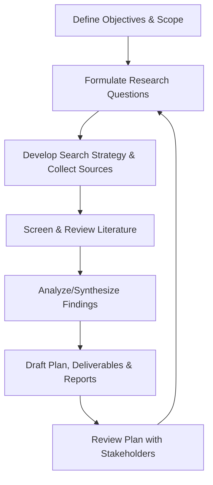
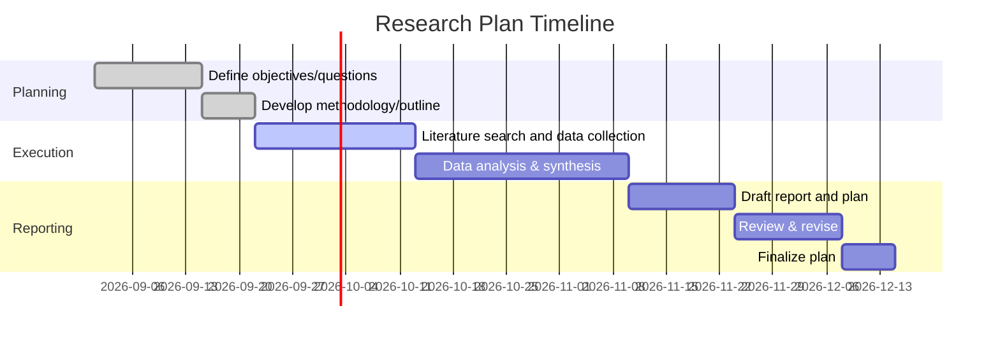

# Executive Summary

A robust research plan formally **defines objectives, scope, questions, methods, timeline, and deliverables** before execution.  It aligns team roles and resources to goals and helps mitigate risks.  This report outlines such a plan: we will clarify objectives and scope (noting any unspecified constraints), formulate key research questions, and describe our methodology (search strategy, sources, criteria).  A realistic timeline with milestones and clear deliverables is proposed.  We also identify necessary team roles (e.g. Principal Investigator, coordinator, data manager) and prioritize authoritative data sources (peer-reviewed studies, official statistics, industry reports).  Risks and limitations (data gaps, biases, time) are acknowledged, with mitigation strategies. Initial literature shows consensus on planning steps: define clear objectives/questions, adopt a systematic search strategy, allow ample analysis time, and specify roles and deliverables. Early findings (below) highlight best practices for each element of the plan.

## Objectives

- **Define the research problem and goals:** Clarify *what* we want to learn or produce. Establish specific, measurable aims (e.g. research outcomes, insights, or products).  
- **Organize the research process:** Identify the major tasks needed to meet objectives (e.g. literature review, data analysis, reporting).  
- **Align stakeholders:** Ensure that everyone (team members, sponsors) understands the purpose and scope, and agrees on goals.  
- **Document methodology in advance:** Plan how to collect and analyze information (search strategy, data collection methods) to achieve objectives.  
- **Produce concrete deliverables:** Specify what outputs (reports, data sets, presentations) will result and how they address the objectives.  

## Scope

- **Research domain:** *Unspecified* (no particular subject given). We assume a general research project context; specific domain constraints would be refined later.  
- **Constraints:** Budget, exact duration, and stakeholder expectations are *unspecified*. We assume a moderate timeline (e.g. a few months) and a typical academic-industry scope. These may be adjusted once clarified.  
- **Inclusions:** The plan will cover literature review, methodology design, analysis, and reporting. It will *prioritize primary sources* (peer-reviewed articles, official reports) and exclude unverified materials.  
- **Exclusions:** Tasks outside core research (e.g. software development, large-scale data collection beyond budget) are out of scope unless specified. We assume no extensive field work or experiments unless indicated.  
- **Assumptions:** We assume access to standard databases (academic journals, industry reports) and that team roles can be filled by qualified personnel. If key information is lacking (e.g. proprietary data), we will note it as a limitation.  

## Key Research Questions

(General example questions to guide the plan, to be refined with stakeholders. These illustrate the lines of inquiry this plan will address:)

1. **What are the specific goals and intended outcomes** of the research task? (e.g. new knowledge, product features, policy recommendations).  
2. **What evidence and data are needed** to achieve the objectives? (e.g. literature evidence, user data, industry benchmarks).  
3. **How can this evidence be collected and analyzed?** (Which methods – surveys, experiments, qualitative interviews, etc. – and which sources?).  
4. **What is the timeline and sequence of tasks?** (When will each phase occur, and what dependencies exist?).  
5. **Who needs to be involved, and what expertise is required?** (Which team roles are needed to cover subject matter, methodology, and data skills?).  
6. **What are the deliverables and milestones?** (What reports, prototypes, or analyses will be produced, and when?).  
7. **What risks or limitations might impact the research?** (For example, data access, ethical issues, time constraints, or biases.) (This plan will document known risks and mitigation.)  

These questions form the foundation of the plan and align with best practices (for example, Oxford guidance stresses well-defined research questions and realistic scheduling).

## Methodology

- **Search strategy:** Conduct a systematic literature search across diverse sources. We will use academic databases (e.g. Google Scholar, PubMed/Medline, IEEE Xplore, Scopus), specialized library catalogs, and reputable industry databases. Grey literature (white papers, industry/NGO reports) will also be consulted to capture non-academic insights. Boolean keywords will be built from key concepts, expanded with synonyms and controlled-vocabulary terms (e.g. thesaurus terms) to ensure coverage.  
- **Databases and sources:** Priority will be given to *official and peer-reviewed* sources – government/NGO publications, major scientific journals, and industry consortium reports (per instruction to “prefer primary/official sites”). We will also survey recognized preprint archives (e.g. arXiv) if relevant, and patent or technical repositories for cutting-edge or original data.  
- **Inclusion/Exclusion Criteria:** We will include sources that are authoritative and relevant (published within an appropriate timeframe, peer-reviewed or official, and directly addressing our key questions). Exclusion criteria may include non-credible websites, outdated materials (>10 years old unless seminal), or off-topic content. Specific criteria (dates, languages, geographic focus) will be defined once the topic is narrowed.  
- **Selection process:** Initial search results will be screened by titles/abstracts against inclusion criteria. Promising sources will be retrieved for full review. We will record the search terms and results (ensuring transparency and reproducibility). Snowballing (checking references of key papers) may also be used to find seminal works.  
- **Data gathering & tools:** Use citation managers (e.g. Zotero) to organize references. If data analysis is needed, we will identify appropriate software (e.g. statistical packages, qualitative analysis tools). All methods (e.g. thematic analysis, meta-analysis, etc.) will be chosen based on the question type; as a generic plan, we remain flexible to adopt both quantitative and qualitative approaches as needed.  
- **Ethical/quality considerations:** We will note any ethical issues (consent, data privacy) and ensure sources are credible. Critical appraisal will assess biases and methodology quality in reviewed studies. The search strategy itself will be documented (keywords, databases, date ranges) to ensure rigor.

Below is a schematic of the research process flow, illustrating the planned stages from defining objectives through reporting:

This flowchart shows an iterative loop: if early findings (G) suggest refinements, questions (B) and methods (C) may be adjusted.  

## Timeline and Milestones

A provisional timeline is shown below (as a Gantt chart) to sequence major tasks. Time estimates are illustrative; actual dates will be adjusted once objectives and scope are finalized. The chart assumes a start in early September 2026 and spans roughly 10 weeks:

- **Tasks & Milestones:** Key phases include *Planning* (objectives, research design), *Execution* (literature search, analysis), and *Reporting* (writing and revision).  Milestones are implied at the completion of each section (e.g. end of search, end of analysis).  
- **Durations:** We allocate extra time for analysis/synthesis (4 weeks) relative to data collection (3 weeks), following guidance to give more time for interpretation.  The final review and revision is also given two weeks.  
- **Dependencies:** Tasks like “Draft report” depend on completed analysis. If data is collected in parallel, overlapping may occur (not shown).  
- **Visualization:** This timeline can be revisited with tools (Gantt chart in project software) as the plan solidifies, ensuring tasks don’t overlap impossibly and workloads are balanced.

## Deliverables

- **Research Plan Document:** A comprehensive plan (this document) including objectives, questions, methodology, timeline, and resources.  
- **Literature Review Summary:** A compiled report of key findings from initial sources (with citations) addressing the research questions. This may include annotated bibliography or synthesized themes.  
- **Data Collection Plan:** (If applicable) Specifications for any data gathering tools or protocols, including instruments or surveys.  
- **Midpoint Report/Presentation:** An interim summary of progress (e.g. key findings to date, refined questions) for stakeholder feedback.  
- **Final Report/Presentation:** Complete report detailing methodology, analysis, conclusions, and recommendations.  Possibly a slide deck for stakeholders.  
- **Supporting Materials:** Appendices such as search logs (keywords, databases), detailed charts/figures, code or questionnaires.  
- **Publications/Outputs:** If relevant, drafts of papers or posters for conferences, or data sets for public deposit. (To be defined based on project goals.)  

These deliverables correspond to tasks and timelines above, and having them defined early helps track progress.  For example, the *Literature Review* deliverable aligns with the “Review Literature” task, and the *Final Report* aligns with the end of the “Reporting” phase.  Each deliverable’s quality criteria and format should be agreed with any stakeholders (e.g. report length, citation style, data formats).

## Roles & Required Expertise

The project will require an interdisciplinary team. Typical roles include:

| Role                         | Expertise / Responsibility                                                          |
| ---------------------------- | ----------------------------------------------------------------------------------- |
| **Principal Investigator (PI)** / Co-PI | Oversees research design and administration. Develops proposal, secures approvals (e.g. ethics/IRB), and ensures objectives are met. Content and methodology leads (often one PI with subject expertise and one with research-methods expertise).  |
| **Project Coordinator / Manager**  | Manages day-to-day logistics: scheduling, communication, record-keeping, and compliance (e.g. IRB protocols). Coordinates team activities and tracks progress. Acts as liaison among team members. |
| **Data Manager / Analyst**         | Designs and maintains data systems. Responsible for data collection tools, data cleaning/validation, and documentation. Conducts analyses (statistical or qualitative coding) as appropriate, and ensures data quality. |
| **Research Assistants / Associates** | Carry out literature searches, collect data, and assist analysis. May include graduate students or field staff for data gathering. They support RI roles like coding transcripts or managing datasets. |
| **Subject-Matter Expert**         | Provides domain-specific knowledge. May not be full-time on project but consulted to ensure relevance of questions and interpretation of findings. |
| **Stakeholders / Advisors** (if any) | Provide guidance or review on relevance, feasibility, and context. Could include clients, industry partners, or end-users. |

These roles can overlap if resources are limited, but the plan should clarify who is responsible for each task.  Early assignment avoids confusion.  Additional expertise (e.g. statistician, UX researcher, librarian) may be added depending on scope.

## Priority Data Sources

We will prioritize **primary and authoritative sources**:  

- **Academic Literature:** Peer-reviewed journals, conference proceedings, and theses in relevant fields. These provide validated, original research findings.  
- **Government and Inter-Governmental Data:** Official reports/statistics from sources like national agencies (e.g. census, health departments) or bodies (e.g. NSF, OECD, WHO). Government data is authoritative and often freely available.  
- **Industry Reports:** Market research and industry association publications can supply current trends and benchmarks (especially for applied topics). Examples include reports by McKinsey, Gartner, or sector-specific trade groups. These complement academic sources.  
- **Reputable News and White Papers:** Authoritative white papers (e.g. from research institutes) and reputable media (for recent developments) may be used selectively to capture the latest insights, but will be cross-checked.  
- **Data Repositories:** If applicable, open data portals (e.g. data.gov, Kaggle) for raw datasets, ensuring citation of source.  
- **Primary Documents:** Patent databases, standards, and legal documents may be consulted if relevant to the subject.  

We will *avoid* over-reliance on secondary summaries or low-credibility sites. As a guideline, “prioritize primary sources whenever possible”.  For example, rather than citing a news article, we would trace it to the original study. Search results will be evaluated for authority (authors, publishers, recency) and relevance.

## Risks & Limitations

- **Scope Uncertainty:** With unspecified topic details, the project may suffer from scope creep. *Mitigation:* Iteratively refine scope with stakeholder input and document any assumptions or boundaries.  
- **Data Access:** Key data or papers may be behind paywalls or proprietary. *Mitigation:* Use institutional access, request copies from authors, or note as a limitation. Consider alternative data sources if needed.  
- **Time Constraints:** Delays in data collection or analysis (e.g. slow responses from interview participants, if applicable) could push the timeline. *Mitigation:* Build buffer time for analysis (as advised) and monitor progress regularly.  
- **Biases and Quality:** Literature may have publication bias or varying quality. *Mitigation:* Use critical appraisal, include grey literature to counter positive-result bias, and report limitations of sources.  
- **Team Capacity:** If roles are understaffed or members leave, continuity may suffer. *Mitigation:* Have backup assignments and documentation (e.g. paired responsibilities, data management plan).  
- **Changing Requirements:** Stakeholder expectations or project goals may evolve. *Mitigation:* Establish clear review points (milestones) where the plan is revisited. Document change management processes (who approves changes).  
- **Technical/Resource Risks:** Unfamiliar tools or methodologies might lead to errors. *Mitigation:* Allocate time for training and pilot tests of methods or tools.  

These risks will be actively managed. For example, assigning a data manager helps ensure data integrity, and a project coordinator can track schedule adherence. All significant risks and mitigation steps will be logged in the project plan.

## Next Steps

1. **Refine Objectives & Questions:** Convene the team/stakeholders to confirm the research objectives and finalize key questions.  
2. **Set Up Resources:** Ensure access to key databases and tools. Assign roles definitively and schedule kick-off meeting.  
3. **Develop Detailed Search Queries:** Create a list of specific keywords and perform pilot searches to test coverage; adjust keywords and inclusion criteria as needed.  
4. **Pilot Search and Screening:** Run initial searches, screen a subset of results to validate relevance criteria, and adjust the strategy.  
5. **Begin Data Gathering:** Systematically collect literature and data according to the search plan. Track progress in a shared log.  
6. **Initial Analysis:** Start organizing and summarizing key findings from early sources to refine plan focus.  
7. **Review and Adjust:** After the first round of findings, review the plan (timeline, tasks) for feasibility and completeness; update any sections as needed.  
8. **Prepare Interim Deliverable:** Compile the initial literature review and project outline for stakeholder feedback around Week 6 (mid-point).  
9. **Continue Iteration:** Based on feedback, iterate on objectives/questions/methods, and proceed to final analysis and reporting.  

The above steps follow a structured research workflow and will be revisited throughout the project to ensure alignment with the objectives and timely completion of deliverables.

## Initial Literature Scan

We identified the following **authoritative sources** on research planning, with brief notes on their relevance:

- **Harvard University (OSP)** – Official guidance: a research plan “outlines the objectives, methodology, and significance” of a project. It emphasizes aligning the plan with funding requirements and feasibility.  
- **Digital.gov (GSA, US)** – Government UX research guide: details plan components (title, context, goals, questions, methods, roles, timeline) for user-research plans. Advises doubling time allotted for analysis.  
- **Oxford Univ. Geography** – Academic proposal guidelines: stresses clear, answerable research questions and a convincing rationale. Recommends a realistic schedule and warns against underestimating writing time.  
- **Anand et al. (2016, *J Anaesthesiol Clin Pharmacol*)** – Peer-reviewed article on research methodology: highlights specifying detailed aims/objectives (including PICO elements) before starting, and describes a structured literature search (keywords, databases such as PubMed and Google Scholar).  
- **Litmaps Guide (Learn)** – Educational resource: advocates searching multiple databases (e.g. PubMed, JSTOR, Google Scholar) and using Boolean operators. Emphasizes critical evaluation and prioritizing primary sources.  
- **CASRAI Grant Guide** – Funding consortium guide (2026): explains that a grant timeline/Gantt charts specific tasks, milestones and deliverables across the funded period. It shows reviewers use timelines to assess feasibility and task dependencies.  
- **Data Management in Ed. Research** – Chapter from a research guide: outlines typical research team roles (PI/Co-PI, project coordinator, data manager, team members) and their responsibilities. Highlights assigning roles early.  
- **Indeed Career Advice** – (Editorial, updated 2026): defines a research plan as an “overview of your entire project” with goals, steps, and timeline. Notes that a plan organizes objectives and helps schedule tasks.  

**Synthesis:**  These sources consistently stress the same core principles.  A clear set of **objectives and questions** is foundational. A detailed **methodology** (search methods, data collection) and documented **search strategy** (keywords, databases) are critical.  A realistic **timeline** with identified tasks and milestones is needed to demonstrate feasibility.  Assigning **roles and deliverables** up front is recommended.  Importantly, all emphasize using **primary, authoritative sources** and documenting processes. Early findings confirm that rigorous planning (outlined above) is key to a successful research effort. 

